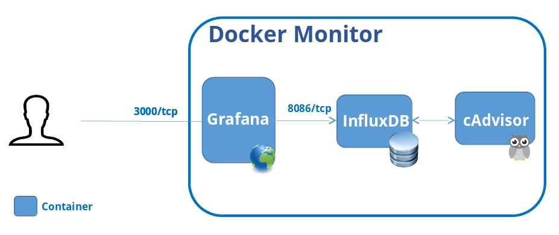
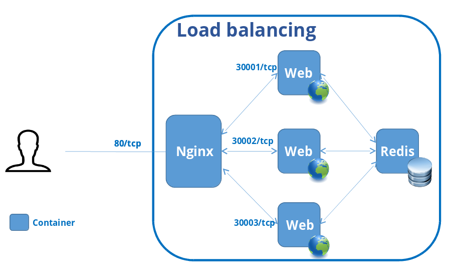

<!-- MarkdownTOC -->

- [Start with Simple Webapp](#start-with-simple-webapp)
- [Monitor docker with cAdvisor + InfluxDB + Grafana](#monitor-docker-with-cadvisor--influxdb--grafana)
    - [Hệ thống monitor](#hệ-thống-monitor)
    - [Monitor docker](#monitor-docker)
- [Load balancing with Mesos + Marathon + Nginx](#load-balancing-with-mesos--marathon--nginx)
- [Autoscaling (coming soon, join us)](#autoscaling-coming-soon-join-us)
- [Contact](#contact)

<!-- /MarkdownTOC -->

# Start with Simple Webapp
**docker-compose.yml**
```yml
web1:
    image: test/counter
    ports:
        - "81:5000"
    links:
        - redis:redis
redis:
    image: redis
```

Access: http://127.0.0.1:81/

# Monitor docker with cAdvisor + InfluxDB + Grafana
## Hệ thống monitor
Cần các thành phần:

- **App agent (sensor)**: thu thập thông tin hệ thống, log và gửi đến bộ phận ghi nhận event
- **Ghi nhận event**: nhận các event từ agent và ghi vào database
- **Database event**: chuyên dụng, được thiết kế để tối ưu hóa việc lưu trữ dữ liệu event theo thời gian.
- **Bộ phận tổng hợp, visualization**: aggregate, trực quan hóa dữ liệu event.


## Monitor docker


- **cAdvisor**: thu thập metrics docker.
- **InfluxDB**: open-source distributed time series database.
- **Grafana**: rich metrics dashboard and graph editor.


Access: http://monitor.coclab.lan:3000/


# Load balancing with Mesos + Marathon + Nginx


**Thử nghiệm:**

1. Start Mesos and Marathon.
2. Start Nginx.

# Autoscaling (coming soon, join us)
Kiến trúc:

1. **Reporters**: lấy thông tin trạng thái hoạt động.
2. **Deciders**: xử lí thông tin, ra quyết định.
3. **Scalers**: thực hiện lệnh scale.


# Contact
- http://www.meetup.com/Docker-Hanoi/
- Trần Hữu Cường: tranhuucuong91@gmail.com
- Nguyễn Văn Thường: thuongnvbk@gmail.com
